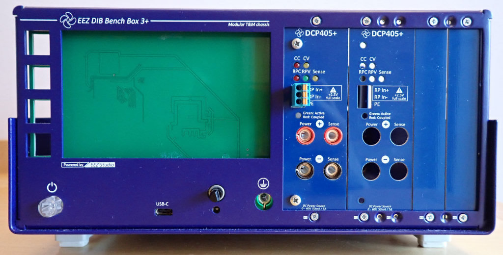
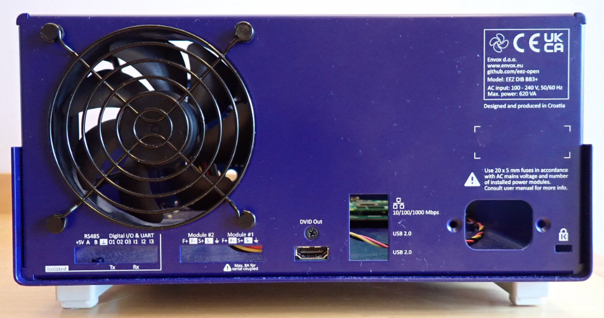
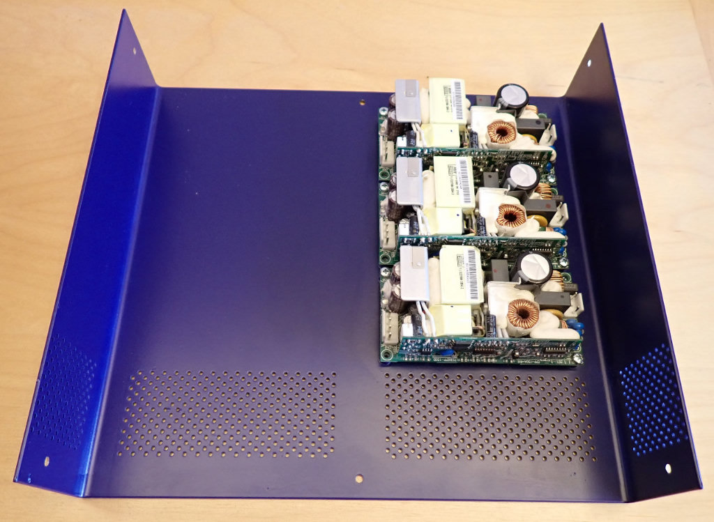

### This is a WORK IN PROGRESS!

---

EEZ BB3+ custom-made enclosure from 1.5 mm thick sheet metal. Powder coated RAL5022. Plastic feet: Altinkaya [A-951-A-0-G-0](https://www.altinkaya.com/shop/a-951-tilt-foot-set-4pcs-set-729)

The new design, unlike the BB3 enclosure, does not require an additional mounting plate for the AC/DC modules, which are now mounted directly on the top panel (up to 3 or stackable up to 6). An additional display mounting frame is also no longer required because the display's PCB is mounted directly to the back of the enclosure's front panel.

Dimensions: 252 (W) x 121.5 (H) x 240 (D) mm  
Total height (with feet mounted): 137 mm  
Empty enclosure weight: 1.05 kg  

---

This work is financed by [NLnet](https://nlnet.nl/project/BB3-CM5/) foundation

