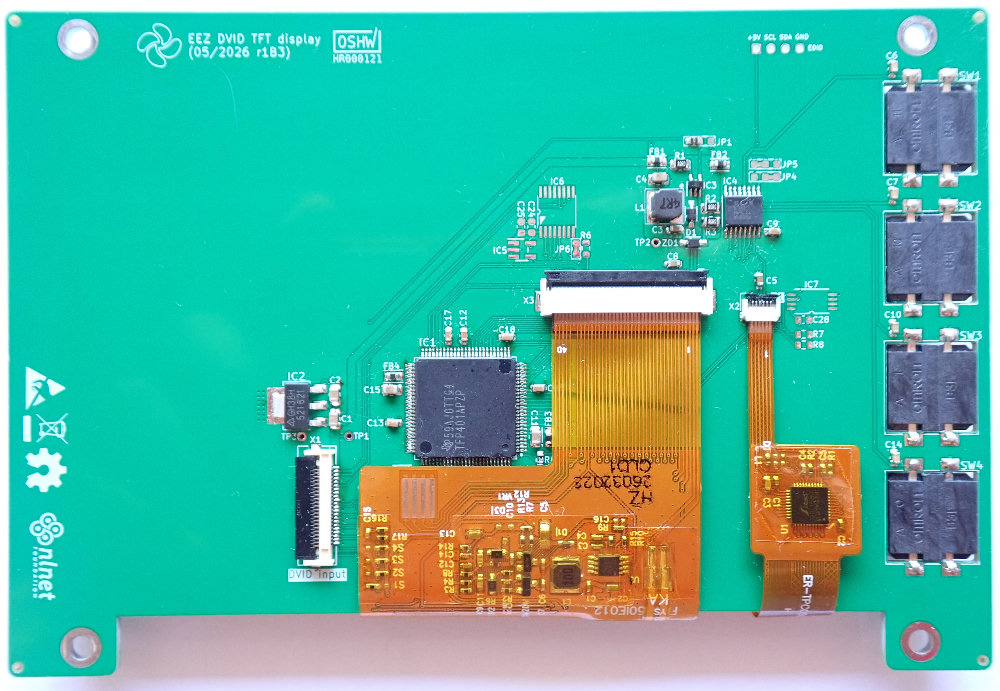
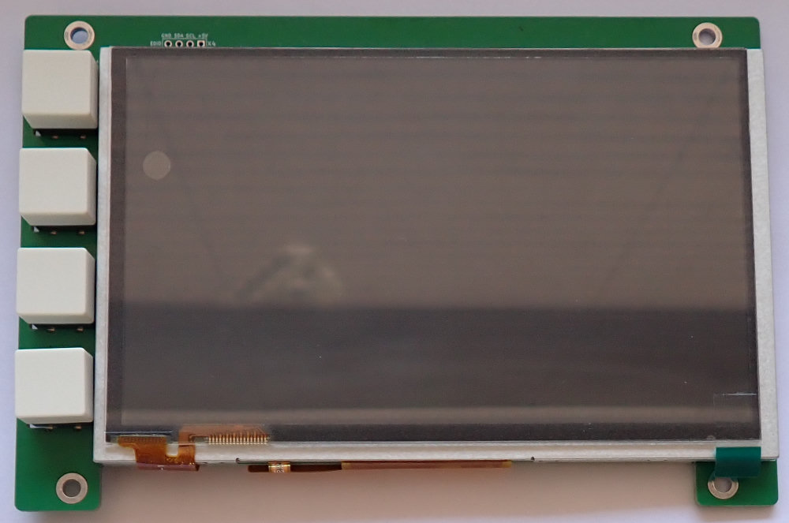

### BB3+ 5" DVID TFT Touchscreeen display (800 x 480) 

* 4 user programmable keys
* 5" TFT LCD capacitive touchscreen
* HDMI® compatible digital video input
* 5V DC input
* Optional resistive touchscreen controller
* Optional EDID EEPROM

### Resources

* [PDF Schematics](../../schematic-diagram/BB3plus%20DVID%20TFT%20display.pdf)
* [BOM](../../fabrication/bom/TFT%20module/BB3plus%20DVID%20TFT%20display.pdf)
* [Interactive BOM](../../fabrication/bom/TFT%20module/ibom.html)

---

This work is financed by [NLnet](https://nlnet.nl/project/BB3-CM5/) foundation

